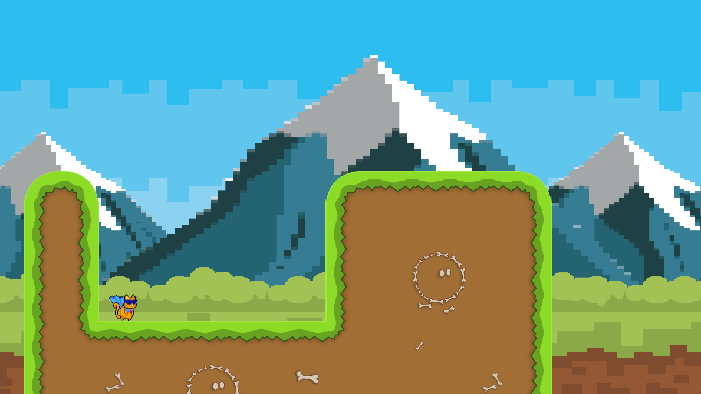

<!-- PROJECT LOGO -->
<br />
<div align="center">
  <a href="https://github.com/Ollicron/Nim-Game">
    
  </a>
</div>

# Nim Game

This is a small guided project I was working on by following:

https://hookrace.net/blog/writing-a-2d-platform-game-in-nim-with-sdl2/

I made adjustments to the original code that made it easier for me to understand. And it's not fully finished, as the scope of what I wanted to achieve was done.

## Compilation

### Prerequisites
You will need the following libraries on your system (install via package manager):
* `sdl`
* `sdl-image`

And you will also need the `basic2d` package from the Nimble Package Directory. To install it run:
* `nimble install basic2d`

### Installation
To compile the program you will need an installation of Nim. Navigate to the directory and run the following:

```
nim c -r -o:game main.nim
```

Then run the game with:
```
./game
```